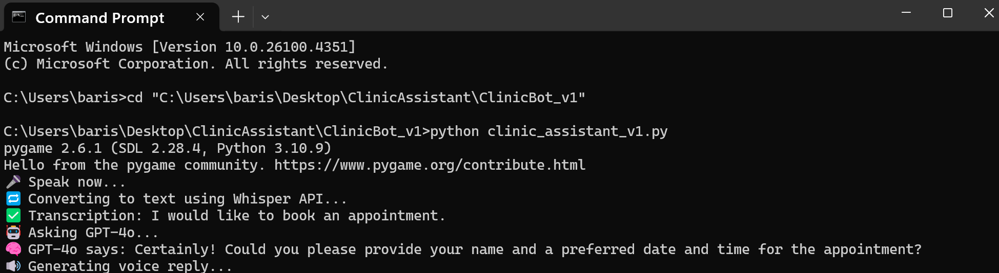
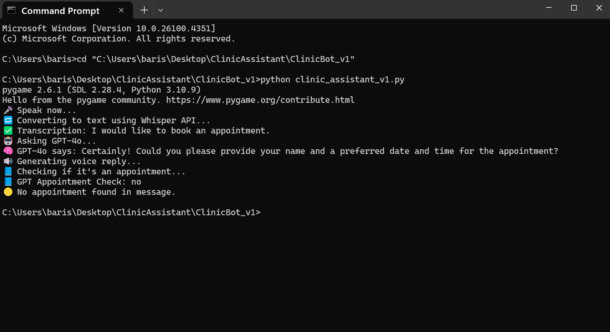

# 🤖 Clinic Assistant v1

This is the first version of a voice-based appointment scheduling system developed for a healthcare clinic. The user speaks, and the system uses OpenAI and Google Calendar APIs to interpret the request and automatically create a calendar event. This version serves as a working prototype that simulates the full appointment flow.

---

## 🚀 Key Features

- 🎤 Microphone input and transcription via Whisper
- 💬 GPT-4o-based intent understanding and response generation
- 🗓️ Automatic Google Calendar event creation
- 🔊 Voice replies using TTS (Nova voice model)
- 📋 Call logs saved to CSV files for follow-up and review

---

## ⚙️ Tech Stack

- Python
- OpenAI (Whisper, ChatGPT-4o, TTS)
- Google Calendar API
- `SpeechRecognition` for audio input
- `pygame` for audio playback
- CSV for logging

---

## 🧪 How It Works

1. The user speaks → `record_and_transcribe()`
2. Audio is transcribed to text via Whisper
3. Text is sent to GPT-4o → response is generated + appointment parsed
4. If an appointment is detected → `create_calendar_event()` triggers calendar update
5. Voice reply is generated using Nova TTS
6. The full call (input + output) is logged to CSV

---

## 💬 Sample Dialog

> 👤 **User:** Hi, I’d like to schedule a PRP appointment for Wednesday at 3 PM.  
> 🤖 **Assistant:** Sure, I’ve scheduled your PRP appointment for Wednesday at 3 PM.  
> 📅 *(Event automatically added to Google Calendar.)*

---

## 🧩 Code Snippets

### 🎤 Record & Transcribe

```python
def record_and_transcribe():
    recognizer = sr.Recognizer()
    with sr.Microphone() as source:
        print("🎤 Speak now...")
        audio = recognizer.listen(source, timeout=None, phrase_time_limit=10)

    with open("temp.wav", "wb") as f:
        f.write(audio.get_wav_data())

    with open("temp.wav", "rb") as audio_file:
        transcription = client.audio.transcriptions.create(
            model="whisper-1",
            file=audio_file
        )

    return transcription.text
```

### 💬 Ask GPT-4o

```python
def ask_gpt(text):
    response = client.chat.completions.create(
        model="gpt-4o",
        messages=[
            {"role": "system", "content": "You are a helpful and polite receptionist AI for a medical clinic."},
            {"role": "user", "content": text}
        ]
    )
    reply = response.choices[0].message.content
    speak(reply)
    log_call(text, reply)
    check_and_create_appointment(text)
```

### 📅 Create Appointment

```python
def create_calendar_event(summary, date_str, time_str, duration_minutes=30):
    service = build('calendar', 'v3', credentials=creds)

    start = datetime.datetime.strptime(f"{date_str} {time_str}", "%Y-%m-%d %H:%M")
    end = start + datetime.timedelta(minutes=duration_minutes)

    event = {
        'summary': summary,
        'start': {'dateTime': start.isoformat(), 'timeZone': 'Europe/London'},
        'end': {'dateTime': end.isoformat(), 'timeZone': 'Europe/London'}
    }

    service.events().insert(calendarId='primary', body=event).execute()
```

---

## 🖼️ Screenshots

| Voice Input Flow | GPT Response | Calendar Entry | CSV Log |
|------------------|--------------|----------------|---------|
|  |  |  |

> 📌 Screenshots are placed in the `screenshots/` folder.

---

## 📌 Notes

- This version provides a basic voice-based interaction loop.
- No GUI or web interface is included.
- Designed to simulate a natural receptionist workflow using AI.

---

### ⚠️ API Key Not Included

For security reasons, the OpenAI API key has been removed from the source code.  
To run the application, insert your own API key in the script before execution.
