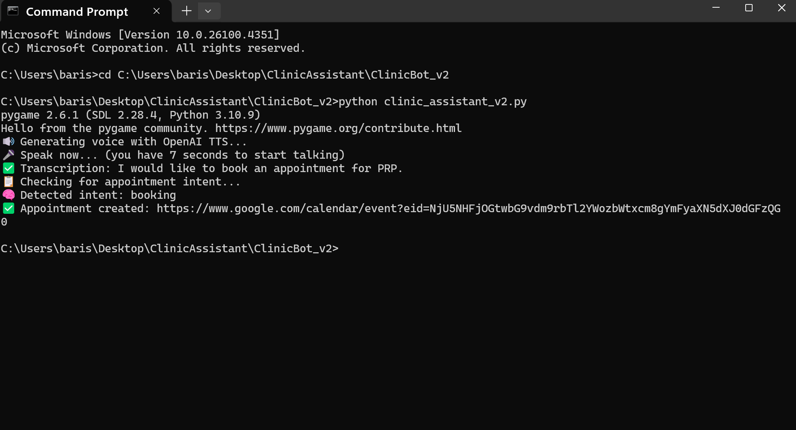

# Clinic Assistant v2 – README

## 🚀 What's New in v2
- Integrated OpenAI GPT-4o for natural language understanding.
- Implemented appointment intent classification and handling.
- Added Google Calendar API integration.
- Full end-to-end appointment booking/rescheduling flow.
- Local microphone input, speech recognition (Whisper), and text-to-speech (TTS) output.
- Improved error handling and logs.

## 💡 How It Works
1. Listens to the user using microphone input.
2. Transcribes audio to text using OpenAI Whisper API.
3. Classifies user intent (booking/rescheduling).
4. Uses GPT-4o to conduct a natural conversation with multi-turn memory.
5. Creates/reschedules appointment via Google Calendar API.
6. Speaks confirmation back to the user using TTS.

> ⚠️ **Note:** API keys are removed for security. Please add your own OpenAI and Google Calendar credentials to run the code.

## 🛠️ Tech Stack
- Python
- OpenAI GPT-4o + Whisper API
- Google Calendar API
- Pyttsx3 (Text-to-Speech)
- SpeechRecognition
- Pyaudio

## 📸 Screenshots
### Booking an Appointment


### Name Prompt by Assistant


### "Speak now" Prompt


## 🧠 Sample Dialog
**User:** I’d like to book an appointment for a PRP session.  
**Assistant:** Sure, can I have your full name please?  
**User:** John Barn  
**Assistant:** And what day and time would you like the appointment?  
**User:** Friday at 2 PM  
**Assistant:** Got it. I’ve scheduled your PRP session for Friday at 2 PM.

## ▶️ How to Run
1. Set up your Python environment (Python 3.9+).
2. Install required packages (`pip install -r requirements.txt`).
3. Add your API keys in the designated variables.
4. Run the app:  
```bash
python clinic_assistant_v2.py
```

## 📁 Folder Structure
```
ClinicBot_v2/
├── clinic_assistant_v2.py
├── README.md
└── screenshots/
    ├── v2_booking.png
    ├── v2_name_prompt.png
    └── v2_speaknow.png
```

---

Developed by Baris Yurttas – 2025
