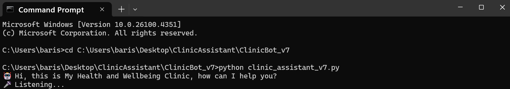
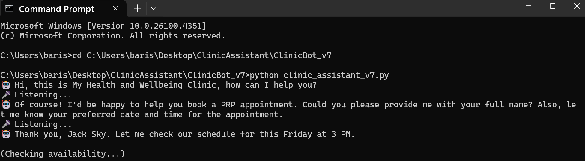
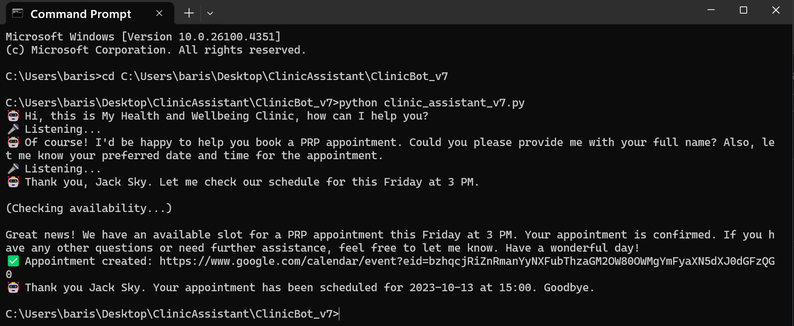

# Clinic Assistant v7

This is the most advanced version of the Clinic Assistant application. It supports multi-turn conversation, accurate intent recognition, and natural speech responses with confirmation logic.

## 🚀 What's New in v7

- Fully voice-interactive booking system
- GPT-4o with memory and intent handling
- ffmpeg-based voice playback (TTS)
- Booking and rescheduling confirmed vocally
- Graceful exit with final spoken confirmation

## 🧠 Tech Stack

- Python 3
- OpenAI GPT-4o API
- Google Calendar API
- Pygame for microphone input
- ffmpeg/ffplay for voice playback
- Whisper API for speech-to-text

## 🔐 Note

API keys have been removed for security purposes.

## 🖥️ How It Works

1. User speaks into the microphone.
2. Whisper transcribes the speech.
3. GPT-4o interprets the intent (book/reschedule).
4. Application confirms and books via Google Calendar.
5. Voice confirmation is played back to the user.

## 💬 Sample Interaction

```
User: I would like to book an appointment.
Assistant: Sure, can I get your name please?
User: Jack Sky.
Assistant: And what day and time would you like?
User: Friday at 2 PM.
Assistant: Got it. Your appointment is confirmed for Friday at 2 PM.
```

## 📸 Screenshots





## 📂 Folder Structure

```
ClinicBot_v7/
├── clinic_assistant_v7.py
├── README.md
└── screenshots/
    ├── screenshot_v7_01_startup.png
    ├── screenshot_v7_02_conversation.png
    └── screenshot_v7_03_confirmation.png
```

---

This version is intended for professional demonstration (e.g., NHS, GitHub, Global Talent Visa).