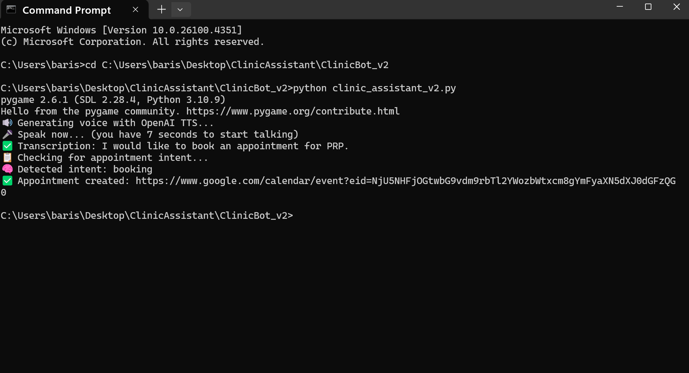

# Clinic Assistant – AI Voice Receptionist (Landline-Powered)

> A human-like AI receptionist that schedules appointments over a landline — no cloud required.

> ⚠️ **Security Notice**: API keys and credentials have been removed from all `.py` files for public release.

This is a multi-version showcase of a scalable, voice-first AI assistant designed for appointment scheduling in clinics, GP practices, and other service-based sectors. The assistant works over standard landlines and eliminates the need for cloud telephony or specialized IT infrastructure.

---

## 🎯 Project Goal

To provide a cost-effective, instantly deployable AI solution that allows clinics to handle 24/7 appointment scheduling with natural voice interaction.

---

## 📺 Demo Video

🎥 [Watch Demonstration](https://drive.google.com/file/d/1fSnoXweF3DPscOMT_REZauueIymp6N_P/view?usp=sharing)

---

## 📸 Sample Screenshots

### Version 1
  
*Basic text input example using intent recognition.*

### Version 2
  
*Voice-based appointment request and assistant’s spoken response.*

### Version 7
  
*Multi-turn conversation with confirmation dialogue.*

---

## 📂 Project Versions

- [`ClinicBot_v1`](./ClinicBot_v1/README.md) – First working prototype: intent detection and appointment booking (text-based).
- [`ClinicBot_v2`](./ClinicBot_v2/README.md) – Voice interaction with GPT-4o, full appointment handling with Google Calendar.
- [`ClinicBot_v7`](./ClinicBot_v7/README.md) – Multi-turn natural dialogue, memory handling, voice confirmation, and realistic clinic demo.

---

## 🛠️ Tech Stack

- Python
- OpenAI GPT-4o
- Google Calendar API
- SpeechRecognition + Text-to-Speech (ffmpeg/ffplay)
- CSV Logging & Appointment Handling

---

## 📈 Why It Matters

- No cloud telephony required – works with a basic landline and PC.
- Ideal for clinics, legal offices, beauty salons, and home services.
- Scalable, modular, and easy to deploy.

---

## 📃 Licensing & Contact

This project is part of a UK Global Talent Visa (Exceptional Talent – Digital Technology) application.  
For collaboration or access to private demonstration data, contact:  
📧 [barisyurttas@gmail.com](mailto:barisyurttas@gmail.com)
